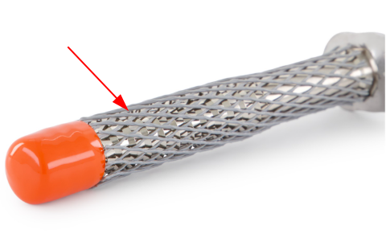
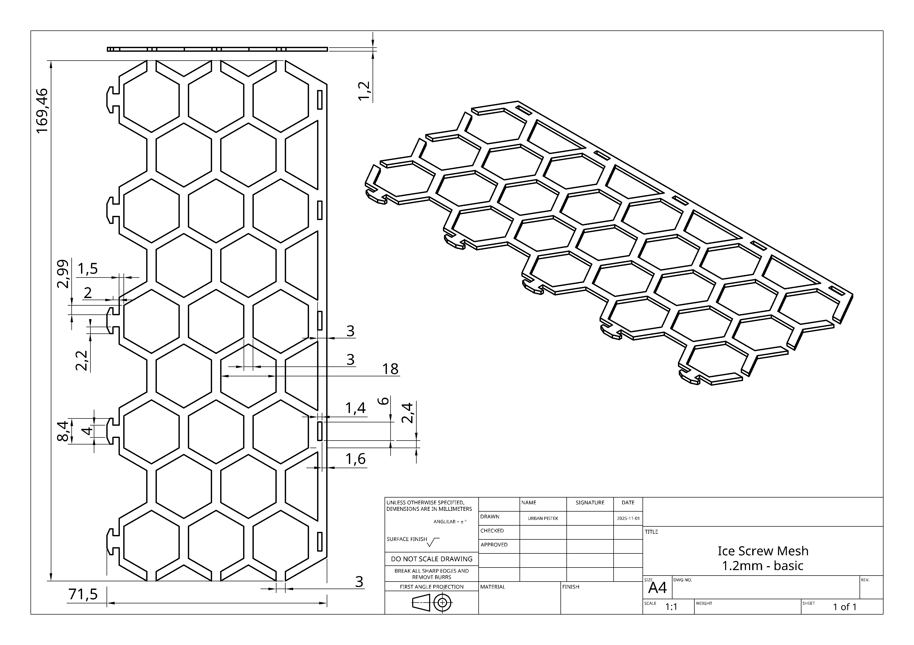
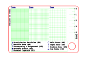
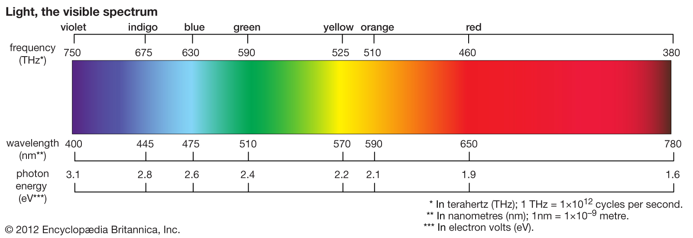

# Making my own Outdoor Winter Gear - Snow Study Card & Ice Screw Mesh

While doing outdoor activities, I ran into 2 seperate but small problems. 

1. I lost the protective mesh for my ice screw
2. I was considering getting a snow study card

I realized I could just make these items myself and figured it would be fun. Additionally, I could open source the process for any one with the means to create it themselves or mirror the process for other projects. 

So that is what I did, and is a complete guide & reference on how I did it. 

### Ice Screw Mesh

First, I will start off with the simplier one to make. 

Often, ice screws have this mesh around them to protect the threads and also to protect you. 
I find it is very easy to loose these meshes. 



I figured it was easy to just model a flat mesh that I can roll up and attach at the ends to create a cylindrical mesh.

I measured the diameter of the screw tooth to tooth since that while be in contact with the mesh.
I used this as the basis of the width for the mesh laying flat. For the basis of the sketch I was able to generate a linear pattern of
hexagon once I had 2 offset in the pattern I wanted. Afterwards it was mostly just a matter of using the cut and trim tool to create all the required connecting
lines and remove the unesscessary ones. 



After some deliberation, I decided the easiest and most effective method of connecting the two ends was just using a hook and slot method since it remove no additional materials (like glue) and the material was flexible so it would be able to bend to hook through the slot. To get the best balance of "effort to push through the slot" and "strength to hold in place" was a little trial and error, but you can see the dimensions I settled on. The hardest part was just getting the sketch right to achieve nice tolerance with the hook and slot linkage but also fit around the ice screw - I wanted it to slide on without too much effort, but still have lots of friction that it will not fall off on its own. 

For 3D printing, from what I have gathered, TPU (thermoplastic polyurethane) is probably the most common / first flexible material everyone starts with. I will say the ability to 3D print flexible parts has been a very nice learning process and opened the door for so many more applications. At this point it was pretty trival, I was able to print it pretty fast and without hiccups. I do think the end result came out pretty clean.


If you want to print this yourself, you can find it on [printables here](https://www.printables.com/model/1373344-flexible-mesh-sheath-designed-for-ice-screws). 

### Snow Study Card

To better analyze snow crystals you can buy this Polycarbonate or Aluminum card that essentially has a grid on it with a couple other features on it. My issue with buying an existing one came down to the following. 

- None of the easily availible ones had a hole large enough for a caribiner to clip through
- Some featured a 1 & 3mm grid, others a 2mm grid, with other features that were on one but not the other
- I did not want to pay the $40 and instead spent about the same on material (used mostly to prototype & make several copies for others) and several evenings over 3 weeks

So with these factors in mind, I spent some time on the design making the following key design decisions. Together these features merge all the functionality of 2 different cards - and add some more to it:

1. I Kept the overall form factor the same as the off the shelf ones
2. A hole was added to fit through a standard caribiner
3. I Added a 1, 2 and 3 mm grid pattern to consolidate all the grid sizes on one card
4. I added a small ruler and the snow crystal shape diagram - with a couple of additional classifications 



I used different colors so I could control how deep certain layers would be cut. Read was to cut through, whereas blue, green and black were different levels of engraving. I used a hash pattern on the letters to engrave away the area as well. Initially I wanted to try and just engrave on the acrylic directly; the issue I ran into was that black cut the best on my laser however there was little contrast for the engraved features so it was practically useless. I tested other colours such as red & green but the contrast was not much better and these colors required much more power to make the cuts since they naturally abosrd much more of the blue light of the laser. 



Ultimately, I could not avoid the reality that more post-processing after cutting will be needed. So I stuck with usign black acrylic since it cut the best, I would recommend going with a matte black option. For my 12W laser, these are the settings I used: 

```
- (Cut) - Red, 250 mm/min, 100% Power, 2x Passes
- (Engrave - Deepest) - Green, 4000mm/min, 80% Power, 1x Passes
- (Engrave - Larger Text / Symbols) - Blue, 4000mm/min, 30% Power, 1x Passes
- (Engrave - Shallow) - Black, 4000mm/min, 10% Power, 1x Passes
```

Once cut, I just poured some white paint over the surface, used the flat edge of some cardboard to spread it around and scrape off the excess. I left it to dry and was left with this: 


Afterwards, I just used some 600 & 1200 grit sandpaper to get the result below. 


Here is a summary of the settings: 

```
Material:
- 3mm Black Acrylic

Laser Settings
- 12W Laser
- 3mm Material Distance
- (Cut) - Red, 250 mm/min, 100% Power, x2
- (Engrave - Deepest) - Green, 4000mm/min, 80% Power, x1
- (Engrave - Larger Text / Symbols) - Blue, 4000mm/min, 30% Power, 1x
- (Engrave - Shallow) - Black, 4000mm/min, 10% Power, 1x

Finish
- White Acrlyic Paint
- Sand with at least 600 grit with water

Laser Cutter
- Creality Falcon2 12W
```

Use this [SVG as the design](./snow_crystal_card_acrylic.svg). 
