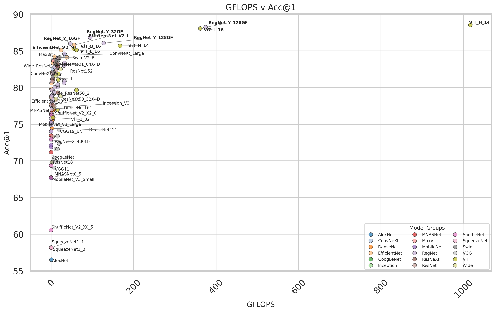

# Fine Tuning Models in Pytorch & Using ONNX for Inference in Python & Rust

## [1] Overview

I want to mostly focus on the Inference side of things and how ONNX can be leveraged, but to get there I want to cover fine tuning a model to serve as a starting point and as a working example. Then I will dive into the specifics of how to use ONNX for inference in both rust and python, also covering how some of the pre-processing transforms can be replicated without having to rely on the transforms used in pytorch. 

### Dataset

Dataset: [Butterfly Image Classification](https://www.kaggle.com/datasets/phucthaiv02/butterfly-image-classification)

I decided to use this image dataset because I thought it was a little more interesting and wanted to work with image based data for this example. If you wish to follow along, download it from the link above.

### Model Tuning & Selection

So why tuning a existing model here? The biggest reasons is efficiency - both in terms of cost and time in addition to getting faster convergence. By taking a more general existing model its weights are already adjusted to a point where it has a strong foundational knowledge in that general task. So tuning it requires much less training time to have adjust to your specific task. There are cases where training from sratch makes more sense, however I do think in a lot of senarios fine tuning just makes a lot of sense, and can give you great results with much less effort - overall more efficient. 

> [Introduction to Fine-Tuning in Machine Learning](https://www.oracle.com/ca-en/artificial-intelligence/fine-tuning/)

So we've selected a image dataset to use for this example and the general problem we are trying to address here is a classification task. So we'll want to select a image classification foundation model to use for our base, from [PyTorch Vision](https://docs.pytorch.org/vision/main/models.html), there are quite a few models to select from for this problem. Naturally, from the table there are so many models to choose from I was not sure what I wanted to select - model selection can be very nuanced but for this sample, I wanted to use a rough critieria to select something decent. 

I started by using some basic web-scraping to pull the table for image classification pre-trained models from [here](https://docs.pytorch.org/vision/main/models.html#table-of-all-available-classification-weights) - if you wish to see how I did this, see this script: `scripts/models_data_scraper.py`. You can also get the data [here](./media/pytorch_models_data.csv) if you wish to do some analysis yourself.

So, I made two graphs:

_v_Acc@1.png)

## [2] Model Tuning

## [3] Exporting to ONNX

## [4] ONNX Inference in Python

## [5] ONNX Inference in Rust

## [6] Summary

## [7] References

1. https://www.kaggle.com/datasets/phucthaiv02/butterfly-image-classification
2. https://www.oracle.com/ca-en/artificial-intelligence/fine-tuning/
