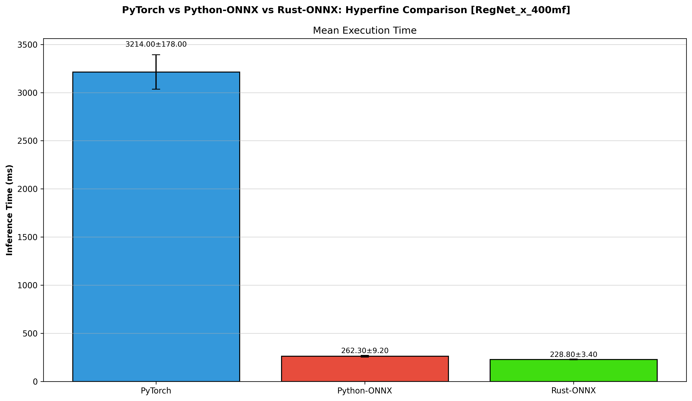
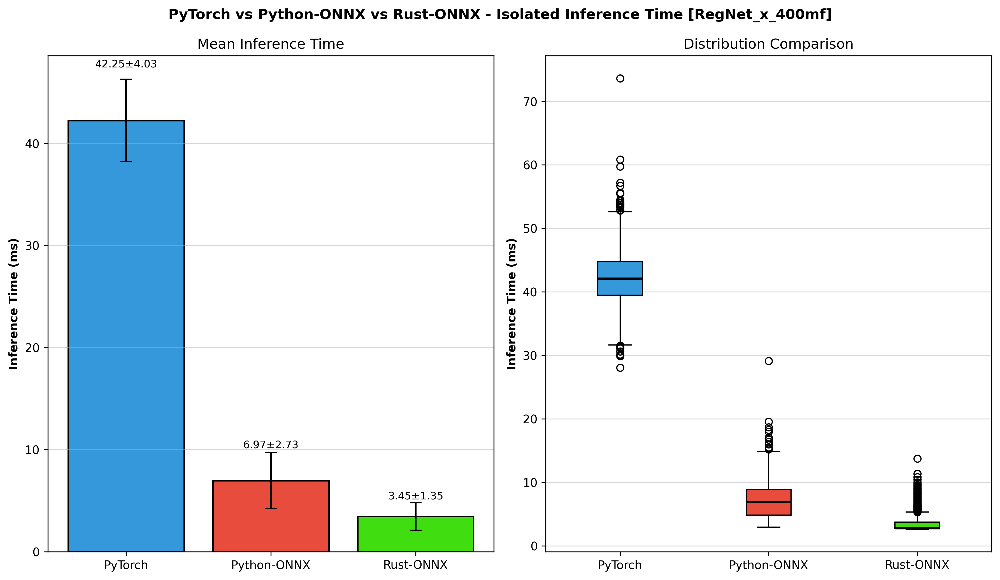

# Benchmarking the Performance of Model Inference in PyTorch & ONNX in Python and Rust

## [1] Overview

I have dug into using ONNX for inference in Python and Rust previously. However, I wanted to examine further the differences 
between the languages to see what how exactly they break down. So here I am mostly going to be looking at the results and seeing how these two approaches stack up. 

I'll be looking at the runtime performance, the inference performance and peak memory usage between inference in PyTorch, Python ONNX and Rust ONNX. Disclaimer, I have setup a couple different methods to benchmark and evaluate to the best of my knowledge - however, there may be some details I have overlooked due to a gap in my knowledge. Nonetheless I will outline my methods below in-case you spot a flaw. I do think my results at least some directional idea and rough comparison. 

## [2] Methods

Firstly, for my tests I and fined tuned 2 different models for image classification that I will be using. 

1. RegNet_x_400mf
2. RegNet_y_16gf

Next I want to look at a few things:

1. Overall runtime performance of the program
2. CPU & Memory usage, better idea of the efficiency of the program
3. Isolated inference performance

To achieve this I utilized a combination of tools - which I am not going to focus on going into more detail here, but I would recommend for anyone to get more familiar with them: 

1. [hyperfine](https://github.com/sharkdp/hyperfine)
2. [perf](https://www.brendangregg.com/perf.html)
3. Custom scripts 

Here is a reference to each inference script / program I used. 
1. [PyTorch Inference](../pytorch_inference.py)
2. [ONNX Python Inference](../onnx_inference.py)
3. [ONNX Rust Inference](../src/main.rs)

## [3] Runtime Performance

To look a the runtime performance I built a sepereate script / program for each test case I had. I then used the hyperfine command to run each multiple times and compile the results. 

**PyTorch**

```
❯ hyperfine --warmup 2 --min-runs 5 'python pytorch_inference.py'
Benchmark 1: python pytorch_inference.py
  Time (mean ± σ):      3.214 s ±  0.178 s    [User: 3.863 s, System: 0.425 s]
  Range (min … max):    3.005 s …  3.442 s    5 runs
```

**ONNX Python**

```
❯ hyperfine --warmup 2 --min-runs 5 'python onnx_inference.py'
Benchmark 1: python onnx_inference.py
  Time (mean ± σ):     262.3 ms ±   9.2 ms    [User: 1433.6 ms, System: 88.7 ms]
  Range (min … max):   247.7 ms … 276.2 ms    11 runs
```

**ONNX Rust** 

```
❯ hyperfine --warmup 2 --min-runs 5 '/target/release/onnx-inference'
Benchmark 1: ./target/release/onnx-inference
  Time (mean ± σ):      91.4 ms ±   2.4 ms    [User: 272.9 ms, System: 56.4 ms]
  Range (min … max):    87.8 ms …  97.6 ms    33 runs
```

Here are the compile results:



I think what stands out to me the most is the massive gap between PyTorch and ONNX here. The gap between Python ONNX and Rust ONNX is in of itself pretty substaintial, but intuitively not that surprising. Seeing such a large difference between the two python based inference environments was interesting to see. Overall, we can see that on just pure runtime inference using Rust and ONNX is significantly faster. 


## [3] Efficiency and Compute

To further examine the efficiency and compute of each test case I used a combination of tools to collect a few data points. Perf for performance statistics, scalence for python profiling, flamegrpah and bytehound for rust profiling. Firstly I utiliize perf to look closely at the CPU based statistics, I've compile a few of the notable stats below. 

| Case | CPU Cycles | CPUs Utilized | Total Time (s) | User Time (s) | System Time (s) | Total Instructions |
| -------- | ------- | ------- | -------- | ------- | ------- | ------- |
| PyTorch| 15,799,457,490 | 1.385 | 2.871612419 | 3.541983000 | 0.436259000 | 13,726,332,782 |
| Python ONNX | 6,111,622,851 | 5.653 | 0.275582306 | 1.473852000 | 0.087991000 | 3,538,600,679 |
| Rust ONNX | 1,201,657,193 | 3.548 | 0.089866657 | 0.258204000 | 0.063049000 | 979,190,216 |

A note on Total vs User vs System Time. 

**Total Time**: The total elapsed time from start to finish
**User Time**: The time the CPU spends on the application's code
**System Time**: The time the CPU spends on executing system-level code (system calls)

From just looking at the table, we can intuitively see why Rust out performed - it had significantly less instructions. However, there is also another interesting insight, although Python ONNX also had less instructions then PyTorch - it also used significantly more CPUs, which is also evident in its User to Total time ratio. So likely part of the increase in performance for ONNX is that it parrallelizes more by default. The fact that rust used multiple CPU makes sense here because in the program I have it set to utilize mutliple threads.

Using scalence and bytehound here is what I found the peak memory usage to be for each. 

| Case| Peak Memory (M) |
| -------- | ------- |
| PyTorch | 221 |
| Python ONNX | 53 |
| Rust ONNX | 47.9 |

Now peak memory is not everything, but it is a data point. Again rust came out on top but in this circumstance it was not signficatly different from the Python ONNX case.

Overall we can see how both in terms of memory, instructions, CPU usage total time Rust is not only faster, but leverages compute resources much more effectly. 

## [4] Isolated Inference Performance

Lastly, I wanted to look at something a little more specific. Which was how fast only the inference portion runs. For this I wrote a custom benchmarking script that ran inference on all the test images and track how long each inference portion took. Here are the results: 



The results here are in line with what we have seen this far, however with the standard deviation there is not statistical difference between Python ONNX and Rust ONNX. However, as mentioned this test is very limited and frankly I would say not as precise as the others. The main takewaway I would say is that when it comes to the pure infernece call, there is not much difference between Python ONNX and Rust ONNX - which makes sense since they are at the end of the day calling the same model with the same number of parameters. The onyl real different being the system calls and instructions each program uses.

## [5] Summary

I think there are a couple of key takeaways from this benchmarking. 

1. The difference between using PyTorch and Python ONNX is pretty substaintial across the board in all categories
2. Using ONNX in Rust out-performs overall and has a substaintial upside, but in a couple of areas it is close to Python ONNX

I hope this was helpful and interesting in both providing some practical numbers to each of these different approaches. Additionally, I hope it gave some insight into testing and evaluating the performance of these different programs. 

## Notes

Note: `_full` postfix -> profiling included the image pre-processing time. 

Profiling Commands

```
scalene onnx_inference.py
```

```
cargo flamegraph --bin onnx-inference
```

```
export MEMORY_PROFILER_LOG=warn
LD_PRELOAD=/home/urban/urban/projects/bytehound-0.11.0/target/release/libbytehound.so ./target/release/onnx-inference
/home/urban/urban/projects/bytehound-0.11.0/target/release/bytehound server memory-profiling_*.dat
```

#### Hyperfine

Python PyTorch
```
❯ hyperfine --warmup 2 --min-runs 5 'python pytorch_inference.py'                                                                                                                   100%
Benchmark 1: python pytorch_inference.py
  Time (mean ± σ):      3.214 s ±  0.178 s    [User: 3.863 s, System: 0.425 s]
  Range (min … max):    3.005 s …  3.442 s    5 runs
```

Python ONNX
```
❯ hyperfine --warmup 2 --min-runs 5 'python onnx_inference.py'                                                                                                                      100%
Benchmark 1: python onnx_inference.py
  Time (mean ± σ):     262.3 ms ±   9.2 ms    [User: 1433.6 ms, System: 88.7 ms]
  Range (min … max):   247.7 ms … 276.2 ms    11 runs
```

Rust - With Graph Level 3, THreads = 4
```
❯ hyperfine --warmup 2 --min-runs 5 'cargo run --release --bin onnx-inference'                                                                                                      100%
Benchmark 1: cargo run --release --bin onnx-inference
  Time (mean ± σ):     260.4 ms ±   5.4 ms    [User: 217.8 ms, System: 127.5 ms]
  Range (min … max):   251.9 ms … 269.3 ms    11 runs
```

Rust - With Graph Disabled, Threads = 4
```
❯ hyperfine --warmup 2 --min-runs 5 'cargo run --release --bin onnx-inference'                                                                                                      100%
Benchmark 1: cargo run --release --bin onnx-inference
  Time (mean ± σ):     234.4 ms ±  15.1 ms    [User: 232.0 ms, System: 109.0 ms]
  Range (min … max):   222.8 ms … 272.8 ms    10 runs
```

Rust - With Graph Disabled, Threads = 0
```
❯ hyperfine --warmup 2 --min-runs 5 'cargo run --release --bin onnx-inference'                                                                                                      100%
Benchmark 1: cargo run --release --bin onnx-inference
  Time (mean ± σ):     234.7 ms ±   6.9 ms    [User: 539.3 ms, System: 110.7 ms]
  Range (min … max):   224.0 ms … 243.0 ms    12 runs
```

Rust - With Graph Disabled, Threads = 8
```
❯ hyperfine --warmup 2 --min-runs 5 'cargo run --release --bin onnx-inference'                                                                                                      100%
Benchmark 1: cargo run --release --bin onnx-inference
  Time (mean ± σ):     228.8 ms ±   3.4 ms    [User: 366.0 ms, System: 106.8 ms]
  Range (min … max):   221.6 ms … 232.8 ms    13 runs
```

Rust - With Graph Disabled, Threads = 8
❯ hyperfine --warmup 2 --min-runs 5 './target/release/onnx-inference'                                                                                                               100%
Benchmark 1: ./target/release/onnx-inference
  Time (mean ± σ):      91.4 ms ±   2.4 ms    [User: 272.9 ms, System: 56.4 ms]
  Range (min … max):    87.8 ms …  97.6 ms    33 runs


##### Perf

Run with: `perf stat <command>`

Rust - With Graph Disabled, Threads = 8
```
 Performance counter stats for './target/release/onnx-inference':

            318.82 msec task-clock                       #    3.548 CPUs utilized             
               160      context-switches                 #  501.852 /sec                      
                21      cpu-migrations                   #   65.868 /sec                      
            15,967      page-faults                      #   50.082 K/sec                     
     1,201,657,193      cycles                           #    3.769 GHz                       
        88,624,041      stalled-cycles-frontend          #    7.38% frontend cycles idle      
       979,190,216      instructions                     #    0.81  insn per cycle            
                                                  #    0.09  stalled cycles per insn   
       158,410,713      branches                         #  496.867 M/sec                     
         3,370,940      branch-misses                    #    2.13% of all branches           

       0.089866657 seconds time elapsed

       0.258204000 seconds user
       0.063049000 seconds sys

```

Python ONNX
```
 Performance counter stats for 'python onnx_inference.py':

          1,558.00 msec task-clock                       #    5.653 CPUs utilized             
               347      context-switches                 #  222.721 /sec                      
                15      cpu-migrations                   #    9.628 /sec                      
            28,474      page-faults                      #   18.276 K/sec                     
     6,111,622,851      cycles                           #    3.923 GHz                       
       234,623,772      stalled-cycles-frontend          #    3.84% frontend cycles idle      
     3,538,600,679      instructions                     #    0.58  insn per cycle            
                                                  #    0.07  stalled cycles per insn   
       559,544,536      branches                         #  359.142 M/sec                     
         9,051,248      branch-misses                    #    1.62% of all branches           

       0.275582306 seconds time elapsed

       1.473852000 seconds user
       0.087991000 seconds sys

```

PyTorch
```
Running Inference on RegNet_x_400mf
Inference Completed in 24.860001052729785ms

=== Inference Results ===
Predicted class index: 50
Predicted class name: Paper Kite
Confidence: 0.9957748055458069
Completed in 72.83094199374318ms

 Performance counter stats for 'python pytorch_inference.py':

          3,976.30 msec task-clock                       #    1.385 CPUs utilized             
               275      context-switches                 #   69.160 /sec                      
                16      cpu-migrations                   #    4.024 /sec                      
            89,963      page-faults                      #   22.625 K/sec                     
    15,799,457,490      cycles                           #    3.973 GHz                       
     2,613,814,359      stalled-cycles-frontend          #   16.54% frontend cycles idle      
    13,726,332,782      instructions                     #    0.87  insn per cycle            
                                                  #    0.19  stalled cycles per insn   
     2,770,290,282      branches                         #  696.700 M/sec                     
        73,013,174      branch-misses                    #    2.64% of all branches           

       2.871612419 seconds time elapsed

       3.541983000 seconds user
       0.436259000 seconds sys

```