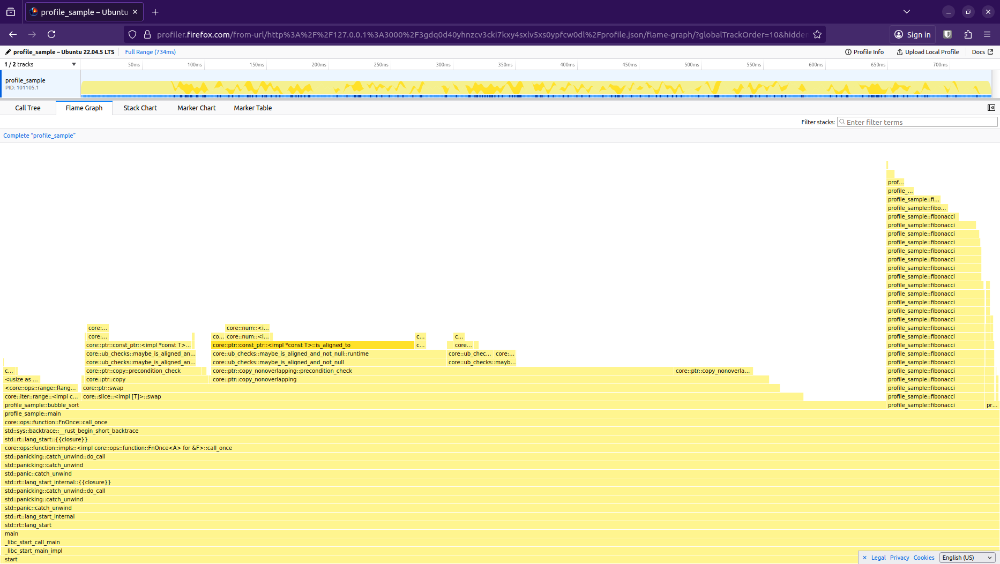
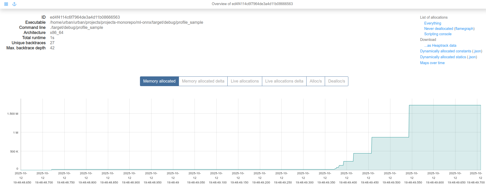

# A Quick Guide to Profiling in Rust

## [1] Overview

Profiling is often an important tool to understand the effects of specific components of software on its performance and use of resources. I find it's important and helpful to profile while developing something - to understand the effects of a specific change - but often its used as a starting point to make optimizations and improvements. Therefore, I've put together a practical guide to quickly see how one can profile their rust code.

**Note:** For these examples, I am using and running `Ubuntu 22.04.5 LTS x86_64` with linux kernel `6.8.0-85-generic`. So some steps may not be relevent to other operating systems or linux distributions.

For all my profiling examples, I'll be using this simple program I built here: 

```rust
fn fibonacci(n: u64) -> u64 {
    if n <= 1 {
        return n;
    }
    fibonacci(n - 1) + fibonacci(n - 2)
}

fn bubble_sort(arr: &mut [i32]) {
    let len = arr.len();
    for i in 0..len {
        for j in 0..len - i - 1 {
            if arr[j] > arr[j + 1] {
                arr.swap(j, j + 1);
            }
        }
    }
}

fn string_operations(iterations: usize) -> String {
    let mut result = String::new();
    for i in 0..iterations {
        result.push_str(&format!("Iteration {}, ", i));
    }
    result
}

fn main() {

    // Recursive function (stack heavy)
    println!("Computing Fibonacci...");
    let fib_result = fibonacci(35);
    println!("Fibonacci(35) = {}", fib_result);
    
    // Sorting (CPU intensive)
    println!("Sorting array...");
    let mut numbers: Vec<i32> = (0..5000).rev().collect();
    bubble_sort(&mut numbers);
    println!("Sorted {} numbers", numbers.len());
    
    // String allocation (memory heavy)
    println!("String operations...");
    let text = string_operations(100000);
    println!("Generated string with {} characters", text.len());
}
```

## [2] CPU Profiling

For linux, the CPU profiling tools use [perf](https://perfwiki.github.io/main/) to collect most of the information on function calls etc. Often you can just use perf directly, but there these tools streamline some of the commands, steps and provide nice visualizations to better examine the results with visuals such as [flamegraphs](https://www.brendangregg.com/flamegraphs.html). 

### flamegraph

For profiling the CPU usage - I found there is in general better notes and information on deoing this for Rust. I have found the [flamegrpah](https://github.com/flamegraph-rs/flamegraph) cargo package to be an easy and effective way to achieve this. 

Follow the installation instructions on the [flamegrpah repository](https://github.com/flamegraph-rs/flamegraph) - they are already pretty helpful, but here are some helpful notes on additional things to look out for. 

If you are not running as root, you maybe need to adjust the permissiveness of `perf` before running, where -1 is the most permissive setting.

```
sudo sysctl kernel.perf_event_paranoid=-1
```

The next thing to keep in mind is for rust if you are running a release build, due to optimizations some information will not be availible and thus you will not be able to generate a good flamegraph to visualize, so either profile with the debug build or be sure to enablign debugging for your builds while profiling. 

```
[profile.release]
debug = true
```

Then you can run your program as follows, this will by default generate a `flamegraph.svg` which you can open in your browser to view the results:

```
cargo flamegraph
cargo flamegraph --bin profile_sample
```


### samply

An alternative is samply - for which install instructions can be found here [samply](https://github.com/mstange/samply). Which samply, you may also need to adjust the `perf` settings as stated above, to run: 

```
cargo run --bin profile_sample && samply record ./target/debug/profile_sample 
```

With samply, this will create a server and open a broswer window to display the results.



## [3] Memory Profiling

For profiling memory for a rust application, the best package I found was [bytehound](https://github.com/koute/bytehound), the installation is a bit more unlcear so here are the steps I took:

1. Install package from [here](https://github.com/koute/bytehound/releases), unzip locally, place in a location of your choice. Remember this location, you'll need it for later. 
2. Ensure gcc, rust >= 1.62 & [yarn](https://yarnpkg.com/) is installed 
3. Build package from the directory where you unzipped the bytehound package, ensure you are in the directory , then run: `cargo build --release -p bytehound-preload`

To run the profiler, here are the steps: 

```
export MEMORY_PROFILER_LOG=warn
LD_PRELOAD=<path_to_bytehound_build>/libbytehound.so <path_to_target_binary>
<path_to_bytehound_build>/bytehound server memory-profiling_*.dat
```

Example: 

```
export MEMORY_PROFILER_LOG=warn
LD_PRELOAD=/home/urban/urban/projects/bytehound-0.11.0/target/release/libbytehound.so ./target/debug/profile_sample
/home/urban/urban/projects/bytehound-0.11.0/target/release/bytehound server memory-profiling_*.dat
```

This will open a server interface for all `.dat` files locally, now you can click an open the one of interest to view.


Now you can see the memory profile.


