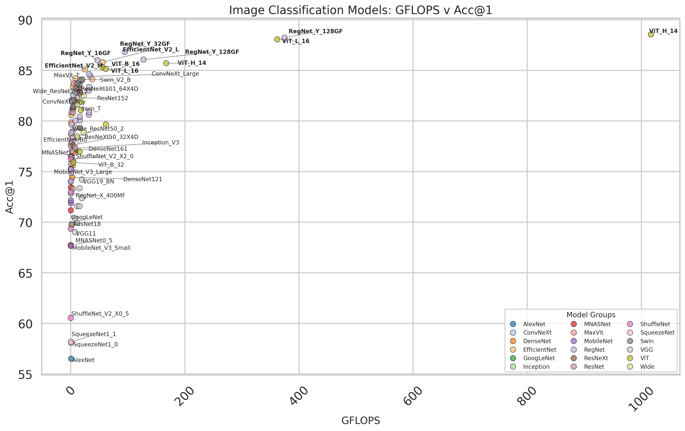
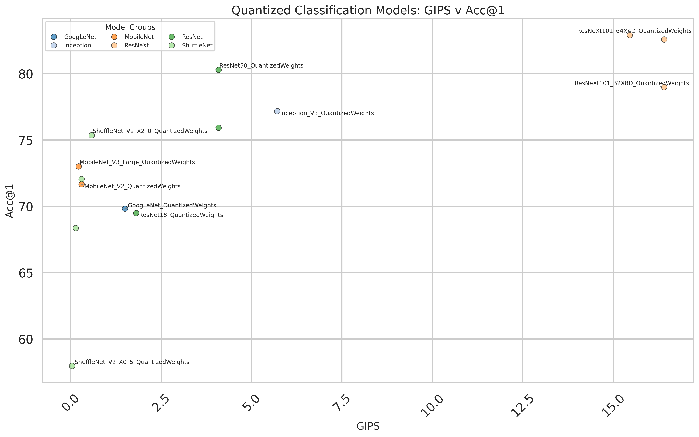
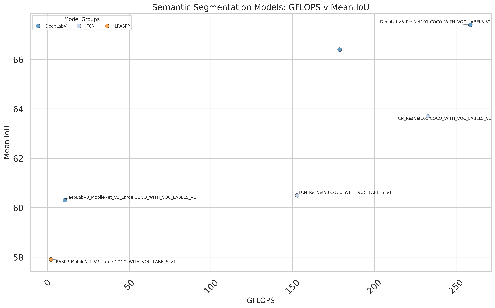
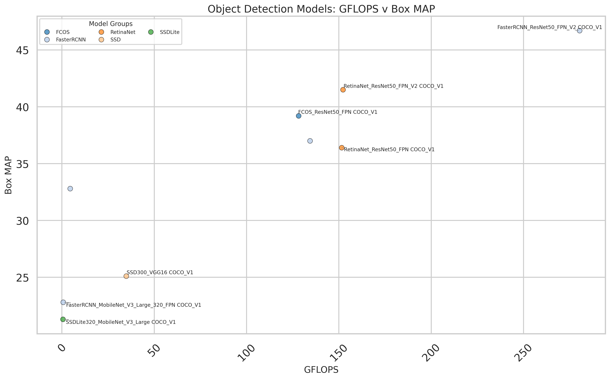
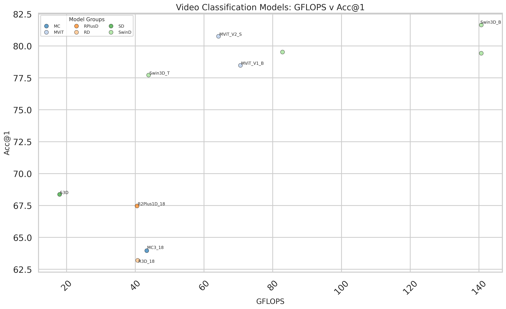

# Analysis of Pytorch Pre-trained Models

## [1] Overview

I was curious to visualize how some of the [PyTorch pre-trained models](https://docs.pytorch.org/vision/main/models.html) compare to each other, the table views does not give the easiest visualization of how certain metrics compare to each other. 

Using some quick and easy web scrpaing with [beautiful soup](https://www.crummy.com/software/BeautifulSoup/), I was able to grab all the table data and extract it into dataframe format:

```python
def get_data_table_from_url(url: str) -> pd.DataFrame:

    # Initialize return
    df = None

    # Get data from url
    response = requests.get(url)
    if response.status_code == 200:

        # Parse html from the response
        soup = BeautifulSoup(response.text, 'html.parser')
        
        # Find all <table> elements
        tables = soup.find_all('table')

        '''
        [0] - n/a
        [1] - Classification weights
        [2] - Quantized models
        [3] - Semantic segmentation weights
        [4] - Object Detection
        [5] - Instance Segmentation
        [6] - Keypoint Detection
        [7] - Video Classification
        '''
        table = tables[1] # After some looking, its the 2nd table that I want
        table_string = io.StringIO(str(table)) # pandas works on html string input

        # We only need the first result for this problem
        tables: list = pd.read_html(table_string)
        df: pd.DataFrame = pd.DataFrame(tables[0])

    return df
```

Here is the raw data of all the pytorch pre-trained models extract for the couple categories of models that had only 1 or 2 different models for those that wish to do some more analysis of their own: 

- [Classification weights](./media/pytorch_classification_models_data.csv)
- [Quantized models](./media/pytorch_quantized_classification_models_data.csv)
- [Semantic segmentation weights](./media/pytorch_segmentation_models_data.csv)
- [Object Detection](./media/pytorch_object_models_data.csv)
- [Video Classification](./media/pytorch_video_models_data.csv)

Below are plots visualizing the accuracy with the number of parameters along with the GFLOPS or similar measures, which helps give a sense of the balance of the size / performance to the accruacy of the models on the particular datasets used for these assessments.

### Image Classification Models

Evaulated on: `ImageNet-1K using single crops`

**Accuracy vs Params**

_v_Acc@1.png)

**Accuracy vs GFLOPS**



---

### Image Classification Quantized Models

Evaulated on: `ImageNet-1K using single crops`

**Accuracy vs Params**

_v_Acc@1.png)

**Accuracy vs GFLOPS**



---

### Semantic Segmentation Models

Evaulated on: `Subset of COCO val2017`

**Accuracy vs Params**

_v_Mean_IoU.png)

**Accuracy vs GFLOPS**



---

### Object Detection Models

Evaulated on: `COCO val2017:`

**Accuracy vs Params**

_v_Box_MAP.png)

**Accuracy vs GFLOPS**



---

### Video Classification Models

Evaulated on: `Kinetics-400`

**Accuracy vs Params**

_v_Acc@1.png)

**Accuracy vs GFLOPS**



---
