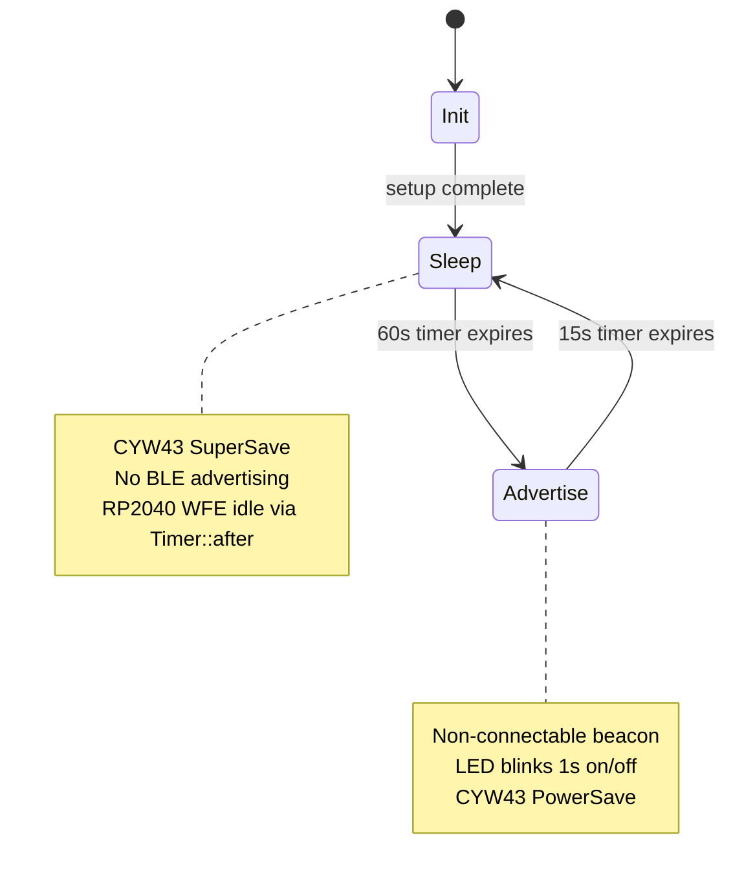

# BLE Beacon with Periodic Sleep/Advertise Cycle

## Goal

Transform `[src/bin/ble.rs](remote_monitor/prototyping/pico-w-embassy-rs/src/bin/ble.rs)` from a continuous LED blink demo into a **beacon-style BLE advertiser** that:

1. Sleeps for **60s** (minimal active work)
2. Wakes for **15s** to **advertise payload data** and **blink the onboard LED** (1s on / 1s off, same as today)
3. Returns to sleep and repeats

No USB logging. Heavy inline comments explaining *how* and *why*.

## Reference implementation

The monorepo already has a working Pico W + CYW43 + TrouBLE pattern in `[remote_monitor/pico-ble-rs/src/main.rs](remote_monitor/pico-ble-rs/src/main.rs)`. We will reuse its BLE stack approach but **strip GATT/connections** and adopt the **existing hardware init style** from the current `ble.rs` (PIO SPI with `DEFAULT_CLOCK_DIVIDER`, dual DMA channels, `aligned_bytes!` firmware paths).

## Architecture




### Runtime concurrency

The CYW43 chip and TrouBLE host **must keep running** for the full firmware lifetime (spawned `cyw43_task` + `runner.run()`). Power savings during the 60s phase come from:

- **No active `Advertiser`** (dropping it cancels HCI advertising — TrouBLE `Drop for Advertiser`)
- `**PowerManagementMode::SuperSave**` on the CYW43 during sleep
- `**Timer::after(60s)**` — Embassy executor idles the RP2040 core (WFE) while waiting

> **Limitation (document in comments):** The CYW43439 radio chip stays powered between cycles. True deep sleep (power-gating WL_ON on PIN_23 and re-init every wake) is significantly more complex and out of scope for this “simple and clear” request.

## File organization

Keep `[src/bin/ble.rs](remote_monitor/prototyping/pico-w-embassy-rs/src/bin/ble.rs)` as the binary entry point and add sibling modules (valid Rust layout for `src/bin/ble.rs`):


| File                                                                                                | Responsibility                                                                        |
| --------------------------------------------------------------------------------------------------- | ------------------------------------------------------------------------------------- |
| `[src/bin/ble.rs](remote_monitor/prototyping/pico-w-embassy-rs/src/bin/ble.rs)`                     | Constants, interrupt bindings, `main`, duty-cycle loop, `join` host runner + app      |
| `[src/bin/ble/cyw43.rs](remote_monitor/prototyping/pico-w-embassy-rs/src/bin/ble/cyw43.rs)`         | `setup()` — PIO SPI, firmware load, `new_with_bluetooth`, CLM init; `task()` — runner |
| `[src/bin/ble/advertise.rs](remote_monitor/prototyping/pico-w-embassy-rs/src/bin/ble/advertise.rs)` | `setup()` — TrouBLE stack + static resources; `run_burst()` — timed beacon            |
| `[src/bin/ble/led.rs](remote_monitor/prototyping/pico-w-embassy-rs/src/bin/ble/led.rs)`             | `run_for()` — blink onboard LED via `control.gpio_set(0, …)` for a duration           |


Each module exposes `**setup`** (one-time init) and `**run_*`** (per-cycle or long-running execution) functions as requested.

## BLE advertising design (beacon)

Use **non-connectable, non-scannable** legacy advertising (`Advertisement::NonconnectableNonscannableUndirected`) so centrals can scan the payload without opening connections — ideal for a 15s broadcast window.

**Advertising payload** (fits 31-byte BLE AD limit):

- `Flags`: `LE_GENERAL_DISCOVERABLE | BR_EDR_NOT_SUPPORTED`
- `CompleteLocalName`: `"PicoW"` (short name to leave room for data)
- `ManufacturerSpecificData`: company ID `0xFFFF` (internal/test) + 4-byte payload:
  - `wake_count` (u32 LE) — increments each advertise cycle so scanners can detect fresh broadcasts

`run_burst()` flow:

```rust
// Pseudocode — actual code will use embassy_futures::join
let advertiser = peripheral.advertise(&params, NonconnectableNonscannableUndirected { adv_data }).await?;
join(
    async { Timer::after(ADVERTISE_DURATION).await; drop(advertiser); },
    led::run_for(&mut control, ADVERTISE_DURATION),
).await;
```

`Advertiser` drop automatically sends HCI disable — no `accept()` needed.

## Main loop (`ble.rs`)

```rust
// Pseudocode
let cyw = cyw43::setup(spawner, peripherals).await;
let (mut peripheral, host_runner) = advertise::setup(cyw.bt_device).await;

let app = async {
    let mut wake_count: u32 = 0;
    loop {
        cyw.set_power_mode(SuperSave).await;
        Timer::after(SLEEP_INTERVAL).await;

        cyw.set_power_mode(PowerSave).await;
        wake_count = wake_count.wrapping_add(1);
        join(
            advertise::run_burst(&mut peripheral, wake_count),
            led::run_for(&mut cyw.control, ADVERTISE_DURATION),
        ).await;
    }
};

join(host_runner.run(), app).await;
```

## Cargo.toml changes

Update `[Cargo.toml](remote_monitor/prototyping/pico-w-embassy-rs/Cargo.toml)`:

- `**cyw43**`: add `"bluetooth"` feature (enables `new_with_bluetooth` + `BtDriver`)
- **New deps** (same git remote as existing Embassy crates):
  - `trouble-host` (git: embassy-rs/trouble)
  - `bt-hci` (crates.io, `default-features = false`)
  - `embassy-futures`
- `**embassy-executor`**: add `"task-arena-size-65536"` (required for CYW43 + BLE tasks; used in `pico-ble-rs`)

No `embassy-usb-logger` — satisfies “no USB logging.”

Keep `defmt-rtt` / `panic-probe` only for panic backtraces; remove all `info!` / `defmt` log calls from the new code.

## Firmware blobs (prerequisite)

`[cyw43-firmware/](remote_monitor/prototyping/pico-w-embassy-rs/cyw43-firmware/)` currently has only README + license — **no `.bin` files in the repo**. Before flashing, download from [embassy cyw43-firmware](https://github.com/embassy-rs/embassy/tree/main/cyw43-firmware):

- `43439A0.bin` — Wi-Fi/BT firmware (already referenced)
- `43439A0_clm.bin` — regulatory blob (already referenced)
- `**43439A0_btfw.bin`** — **new requirement** for Bluetooth (used by `new_with_bluetooth`)

Paths in `ble.rs` already use `aligned_bytes!("../../cyw43-firmware/...")` relative to `src/bin/`.

## Comment style

Each module gets a top-of-file overview (what it does, why it exists). Key blocks explain:

- Why PIO SPI + dual DMA (Pico W’s nonstandard CYW43 bus)
- Why `cyw43_task` must be spawned and never blocked
- Why TrouBLE sits above `bt-hci` / CYW43 HCI
- BLE AD structure encoding and the 31-byte limit
- Why `Advertiser` drop stops advertising
- Power mode choices during sleep vs advertise
- Why `embassy_futures::join` runs LED + advertise concurrently

## Verification

After implementation:

```bash
cd remote_monitor/prototyping/pico-w-embassy-rs
cargo build --bin ble
```

On hardware (with firmware blobs present): flash `ble` UF2, scan with a phone BLE scanner (nRF Connect, etc.) — device should appear as **"PicoW"** only during 15s windows, with manufacturer data changing `wake_count` each cycle; LED blinks during those windows only.